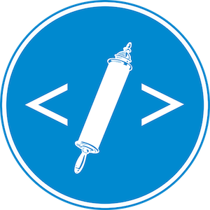

# linksyr
[ Software Heritage Archive](https://archive.softwareheritage.org/browse/origin/https://github.com/ETCBC/linksyr/)

[LinkSyr](https://www.clariah.nl/projecten/research-pilots/linksyr/linksyr).

Work-in-progress and results of the CLARIAH research pilot

## Licensing

All software in this repo is licensed under the Unlicense licence, which means: it is public domain.
If you use it, we will be grateful for an attribution or acknowledgement, but you are not obliged to.

This repository also contains data from the SEDRA and Syriaca websites.
We refer to those sites for licensing information.
To the best of our knowledge all data is as free as a CC-BY-NC licenses stipulates.

This is work in progress.
In a later stage, we will state more explicit licensing conditions here.
